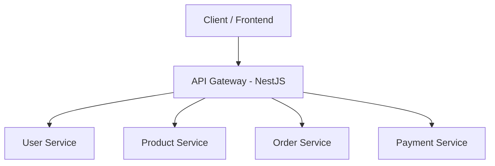

# API Gateway - Marketplace Microservices

API Gateway responsável por centralizar e rotear as requisições de clientes para os microserviços do sistema de marketplace.

Este projeto implementa o padrão **API Gateway**, atuando como camada de entrada para autenticação, roteamento e comunicação entre clientes e serviços internos.

---

# Architecture

O sistema segue uma arquitetura baseada em **microservices**, onde o **API Gateway** atua como ponto único de entrada para as requisições do cliente.

Fluxo básico da aplicação:

Client → API Gateway → Microservices

O gateway é responsável por:

* Roteamento de requisições
* Padronização de respostas
* Centralização de logs
* Camada de segurança
* Monitoramento de serviços

---

# System Architecture



---

# API Gateway Responsibilities

O **API Gateway** centraliza preocupações comuns entre os serviços:

* Request Routing
* Service Discovery
* Health Check de serviços
* Padronização de respostas
* Centralização de logs
* Observabilidade

Funcionalidades planejadas:

* Rate Limiting
* Autenticação e autorização (JWT)
* Circuit Breaker
* Monitoramento com Prometheus

---

# Health Check

O gateway verifica periodicamente a saúde dos microserviços registrados.

### Endpoint

```
GET /health
```

### Exemplo de resposta

```json
{
  "user-service": "UP",
  "product-service": "UP",
  "order-service": "DOWN"
}
```

Esse endpoint permite identificar rapidamente quais serviços estão disponíveis no sistema.

---

# Proxy Service

O módulo **proxy** é responsável por encaminhar requisições para os microserviços.

Ele funciona como um **middleware de comunicação entre serviços**, responsável por:

* Identificar o serviço de destino
* Encaminhar requisições HTTP
* Receber e retornar a resposta ao cliente

Arquivo principal:

```
src/proxy/service/proxy.service.ts
```

Esse serviço utiliza **HttpService (Axios)** para comunicação entre o gateway e os microserviços.

---

# Environment Variables

Exemplo do arquivo `.env`:

```
PORT=3005

USER_SERVICE_URL=http://localhost:3001
PRODUCT_SERVICE_URL=http://localhost:3002
ORDER_SERVICE_URL=http://localhost:3003
PAYMENT_SERVICE_URL=http://localhost:3004
```

Essas variáveis definem os endereços dos serviços registrados no gateway.

---

# Technologies

Tecnologias utilizadas no projeto:

* **NestJS**
* **Node.js**
* **TypeScript**
* **Axios**
* **Jest**
* **Docker** (planejado)

---

# Project Structure

Exemplo simplificado da estrutura do projeto:

```
src
 ├── config
 │   └── gateway.config.ts
 │
 ├── proxy
 │   ├── controller
 │   └── service
 │        └── proxy.service.ts
 │
 ├── health
 │   └── health.controller.ts
 │
 ├── app.controller.ts
 ├── app.module.ts
 └── main.ts
```

---

# Roadmap

Próximas melhorias planejadas para evolução da arquitetura:

* Implementação de **JWT Authentication**
* **Rate Limiting**
* **Circuit Breaker**
* **Centralized Logging**
* **Observability com Prometheus e Grafana**
* **Containerização com Docker**
* **Deploy em AWS**
* Integração com **Service Discovery**

---

# Project Goal

Este projeto foi desenvolvido com o objetivo de praticar conceitos avançados de **arquitetura de microserviços**, incluindo:

* API Gateway Pattern
* Comunicação entre serviços
* Centralização de roteamento
* Monitoramento de serviços
* Observabilidade em sistemas distribuídos

---

# Author

Desenvolvido por **Carlos Candele**

Backend Developer | Java | Spring Boot | Node.js | Microservices | Cloud Architecture
